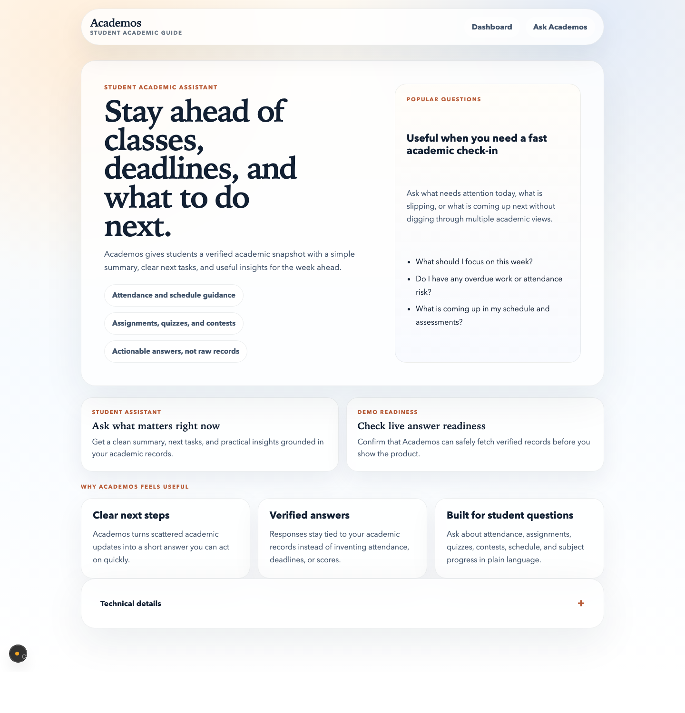
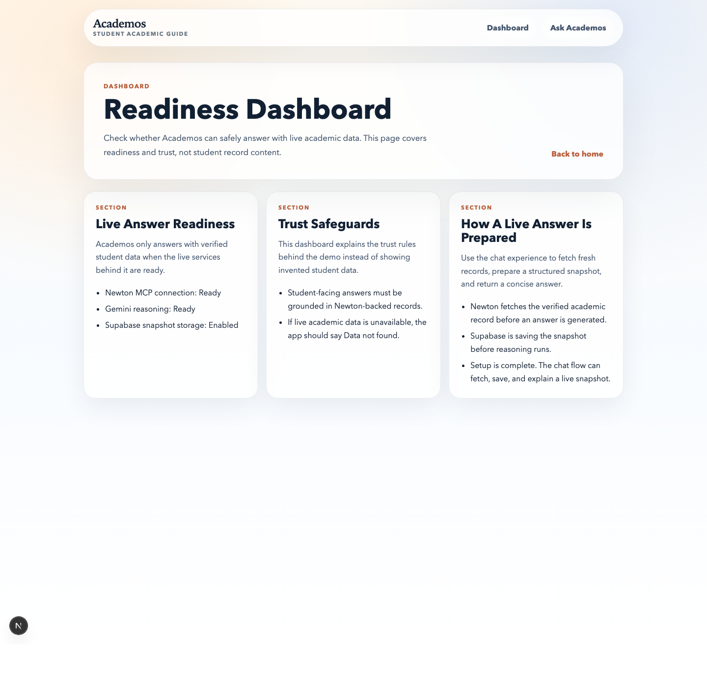
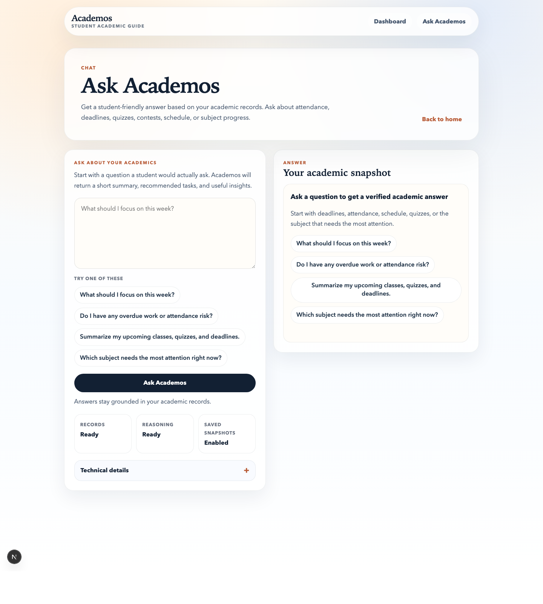

# Academos

Academos is a student-facing academic assistant built with Next.js. It fetches verified academic data through Newton MCP, optionally stores a normalized snapshot in Supabase, and uses Gemini to turn that data into a clean summary, next tasks, and practical insights.

The product is designed for demo-safe academic guidance:

- student-friendly landing page and chat flow
- verified answers grounded in Newton-backed records
- optional Supabase persistence for saved snapshots
- technical details available in the UI, but collapsed by default
- a readiness dashboard that explains setup and trust safeguards

Architecture report:

- [`PROJECT_REPORT.md`](./PROJECT_REPORT.md)

## Project Overview

Academos helps a student answer questions such as:

- What should I focus on this week?
- Do I have any overdue work or attendance risk?
- What classes, quizzes, or deadlines are coming up?
- Which subject needs the most attention right now?

Instead of showing raw records, the app returns a structured answer with:

- `summary`
- `tasks`
- `insights`

The current product includes:

- a polished landing page for demos and GitHub presentation
- a readiness dashboard for setup and trust validation
- a chat page for student-facing academic questions
- an API layer that preserves the existing Newton MCP, Supabase, and Gemini flow

## Screenshots







## Architecture

### Runtime flow

Without persistence:

`Newton MCP -> Next.js backend -> Gemini -> UI`

With persistence enabled:

`Newton MCP -> Next.js backend -> Supabase -> Gemini -> UI`

### High-level request lifecycle

1. A student submits a question from the chat UI.
2. The backend fetches the relevant academic data from Newton MCP.
3. If Supabase is configured, the normalized snapshot is stored.
4. Gemini receives the available academic snapshot and returns structured output.
5. The UI renders a summary, tasks, and insights.

### Core modules

- [`app/page.js`](./app/page.js): landing page
- [`app/dashboard/page.js`](./app/dashboard/page.js): readiness dashboard
- [`app/chat/page.js`](./app/chat/page.js): chat page wrapper
- [`app/chat/ChatClient.js`](./app/chat/ChatClient.js): chat UI, setup checks, and response rendering
- [`app/api/route.js`](./app/api/route.js): runtime status endpoint
- [`app/api/ask/route.js`](./app/api/ask/route.js): academic reasoning endpoint
- [`lib/newton-mcp.js`](./lib/newton-mcp.js): Newton MCP client and snapshot builder
- [`lib/gemini.js`](./lib/gemini.js): Gemini integration
- [`lib/supabase.js`](./lib/supabase.js): snapshot persistence helpers
- [`lib/runtime-status.js`](./lib/runtime-status.js): runtime readiness checks
- [`supabase/schema.sql`](./supabase/schema.sql): required database schema for persistence

## Setup Steps

### 1. Install dependencies

```bash
npm install
```

### 2. Add Newton MCP to Codex

```bash
codex mcp add newton -- npx -y @newtonschool/newton-mcp@latest
```

If Newton asks for authentication later:

```bash
npx -y @newtonschool/newton-mcp@latest login
```

### 3. Configure environment variables

```bash
cp .env.example .env.local
```

Fill in the required values for Gemini. Add Supabase credentials only if you want persisted snapshots.

### 4. Apply the Supabase schema

If you want persistence, run the SQL from [`supabase/schema.sql`](./supabase/schema.sql) in your Supabase SQL editor.

### 5. Start the app locally

```bash
npm run dev -- --hostname 127.0.0.1 --port 3000
```

### 6. Open the app

```text
http://127.0.0.1:3000
```

## Environment Variables

Create `.env.local` from `.env.example` and set the following values:

| Variable | Required | Purpose |
| --- | --- | --- |
| `GEMINI_API_KEY` | Yes | Enables Gemini reasoning |
| `GEMINI_MODEL` | No | Overrides the default Gemini model |
| `SUPABASE_URL` | No | Enables snapshot persistence |
| `SUPABASE_SERVICE_ROLE_KEY` | No | Allows server-side snapshot insert/update access |
| `SUPABASE_ACADEMIC_SNAPSHOTS_TABLE` | No | Overrides the default snapshots table name |

Example:

```bash
GEMINI_API_KEY=your_gemini_api_key_here
GEMINI_MODEL=gemini-2.5-flash-lite
SUPABASE_URL=https://your-project-id.supabase.co
SUPABASE_SERVICE_ROLE_KEY=your_supabase_service_role_key_here
SUPABASE_ACADEMIC_SNAPSHOTS_TABLE=academic_snapshots
```

## Demo Queries

Use these during the final demo:

- What should I focus on this week?
- Do I have any overdue work or attendance risk?
- Summarize my upcoming classes, quizzes, and deadlines.
- Which subject needs the most attention right now?
- What is my next important academic action?
- Give me a summary of my current attendance and pending work.

## API Response Shape

The chat UI expects a structured response in this format:

```json
{
  "summary": "",
  "tasks": [],
  "insights": [],
  "source": "supabase-gemini",
  "snapshotId": ""
}
```

If data is unavailable, the reasoning layer should return:

```json
{
  "summary": "Data not found",
  "tasks": [],
  "insights": []
}
```

## Limitations

- The full end-to-end experience depends on a working local Newton MCP setup in Codex.
- Gemini credentials are required for live reasoning.
- Supabase is optional, but snapshot persistence requires valid Supabase credentials and schema setup.
- The product currently focuses on structured academic answers, not long multi-turn conversation memory.
- The dashboard is intentionally a readiness and trust surface, not a student analytics dashboard.

## Future Scope

- Saved student conversation sessions
- Personalised follow-up prompts and reminders
- Richer academic trend visualisations
- Filtered views for subject-wise and semester-wise analysis
- Exportable summaries for mentors or student advisors
- Notification flows for risk, deadlines, and attendance drops

## Available Routes

- `/`: landing page
- `/dashboard`: readiness and trust dashboard
- `/chat`: student-facing academic chat
- `/api`: runtime status endpoint
- `/api/ask`: academic reasoning endpoint

## Useful Commands

Install dependencies:

```bash
npm install
```

Run locally:

```bash
npm run dev -- --hostname 127.0.0.1 --port 3000
```

Build for production:

```bash
npm run build
```

## Summary

Academos keeps the backend architecture intact while presenting the product as a polished student-facing academic assistant. Newton MCP remains the source of truth, Gemini produces the structured answer, and Supabase continues to support snapshot persistence when enabled.
